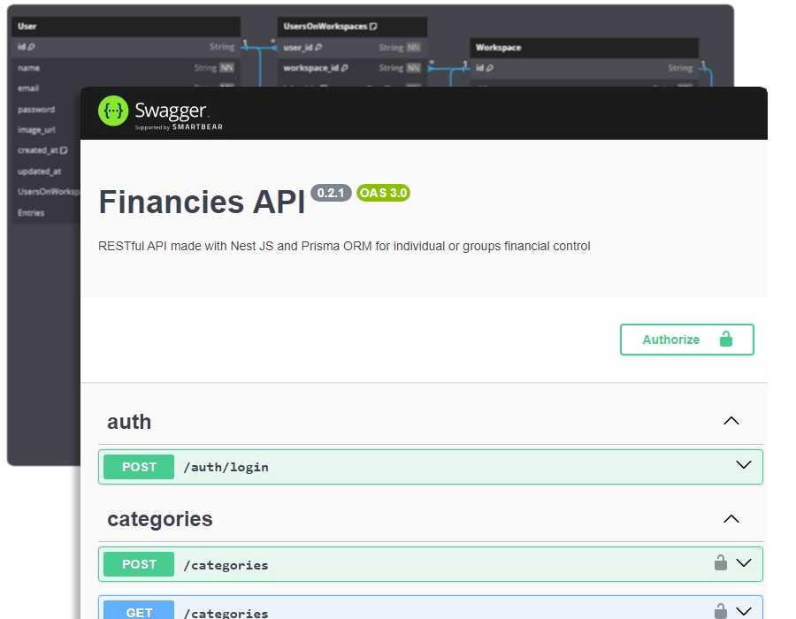
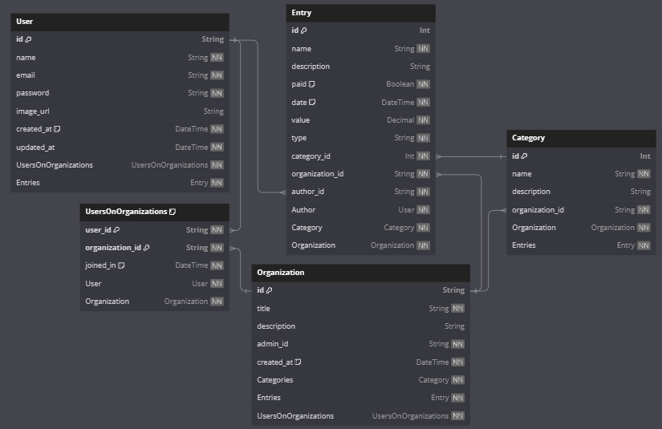

<h1 align="center">
  Projeto NestJS - API De Finanças
  <a href="http://nestjs.com/" target="blank"></a>
</h1>

<p align="center">

  
  
  
  
  
  
  

</p>

<p align="center">
  
</p>

## 🗿 Projeto

Essa aplicação é um Backend de um domínio de **Controle Financeiro**, no qual um usuário ou grupo de usuários pode controlar seus gastos financeiros (receitas e despesas) e visualizá-las filtrando por mês e ano, ou visualizá-los por responsáveis.

> Um **Usuário autenticado** cria uma **Organização** e nela, é criada as **entradas financeiras** (receitas e despesas), que são **categorizadas** por meio de **Categorias** que o próprio usuário cria.
>
> É possível que **Usuários** crie quantas **Organizações** ele desejar, e convidar outros **usuários** para participar também do controle financeiro dessa organização

A arquitetura desse Backend baseia-se sendo um servidor web RESTful criado com o framework **NestJS**, que utiliza do **Prisma ORM** para fazer consultas no banco de dados **SQLite** criado localmente.

Ele tem a finalidade de validar as requisições feitas pela interface web (outra aplicação [Minhas Financias](https://github.com/Brendon3578/project-angular-my-financies) criada em Angular), validando essas requisições antes de interagirem propriamente com o Banco de dados.

Com ele é possível:

- Cadastrar e autenticar usuário via JWT (JSON Web Tokens)
- Criar financias de despesa e entrada para controle financeiro e categorizá-las via tags de categorias
- Criar organizações para centralizar os gastos financeiros de equipes ou setores
- Adicionar ou remover Usuários dentro dessa organização permitindo a colaboração e monitoramento continuo nos gastos

## 🔥 Iniciar a aplicação

```bash
# Baixar as dependências
npm install

# Popular o banco de dados através do Prisma (prisma/seed.ts)
npx prisma db seed

# Iniciar o servidor nest no ambiente de desenvolvimento na porta 3000 (http://localhost:3000)
npm run start:dev
```

Os endpoints da API foi documentados utilizando o Swagger UI, para acessar a documentação basta inicializar a aplicação e abrir a seguinte URL `http://localhost:3000/v1/docs`

## ✨ Tecnologias

- [NestJS](https://nestjs.com/) - framework utilizado para criar a aplicação do servidor
- [Prisma](https://www.prisma.io/) - Object-Relational Mapping (ORM) utilizado para facilitar a conexão entre o servidor web Nest e o banco de dados SQLite criado localmente (no arquivo `db.json`)
- [SQLite Database](https://www.sqlite.org/) - Banco de dados utilizado para a implementação um banco de dados simples e rápido dentro da aplicação de forma local
- [PassportJS](https://www.passportjs.org/) - biblioteca  para autenticação de rotas do nest via estratégia [JWT ( JSON Web Token)](https://jwt.io/)
- [Swagger UI](https://swagger.io/tools/swagger-ui/) - ferramenta utilizada para documentar a API através de uma Interface fácil de ser usada e manipular a API em tempo real

## 🔮 Estrutura da aplicação

Para ver a estrutura da aplicação o funcionamento de cada parte da aplicação, veja [📁 Estrutura da Aplicação](./docs/application.md)

## Estrutura do Banco de Dados

Diagrama de Entidade-Relacionamento (ER) do Banco de Dados, gerado via linguagem DBML (Database Markup Language) e a plataforma [DB Diagram](https://dbdiagram.io/d)

<p align="center">
  <kbd>
    
  </kbd>
</p>

## Outros comandos

```bash
# aplicação no ambiente de desenvolvimento
$ npm run start

# aplicação no ambiente watch mode (observação)
$ npm run start:dev

# aplicação no ambiente de produção
$ npm run start:prod

# Rodar testes unitários
$ npm run test

# Rodar testes e2e
$ npm run test:e2e

# Ver cobertura dos testes
$ npm run test:cov
```

<h3 align="center">
    Feito com ☕ por <a href="https://github.com/Brendon3578"> Brendon Gomes</a>
</h3>
